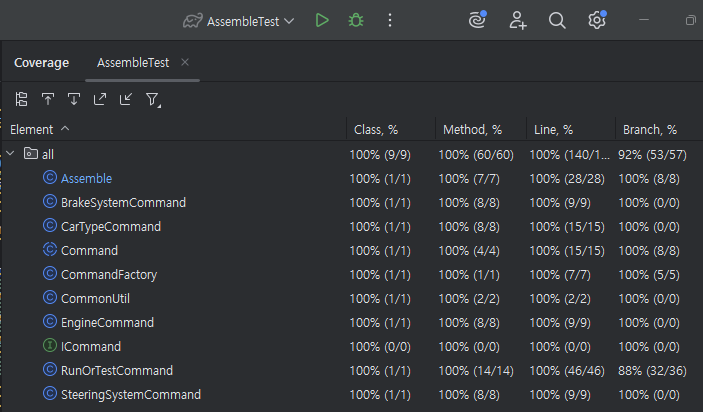

- [x] D1: 가독성있는 코드로 함수분리, 가독성 좋은 네이밍 사용
- [x] D2: Regression Test 를 위한 Unit Test 개발 [commit](https://github.com/jae1-shin/cra_250724/commit/201779cf12b6ae653423ad8029af75b9bcf270c2)
- [x] D3: 확장성을 고려한 설계, 부품이 추가되더라도 Client Code에 변경이 없도록 한다.
- [x] D4: 리팩토링에 디자인 패턴을 적용한다. (D3+D4: 전략 패턴(인터페이스 - 추상 클래스 - 구현 클래스), 단순 팩토리 패턴)
- [x] D5: 리팩토링이 끝난 코드에, 코드 커버리지가 100% 되어야 한다. (아래 이미지)

